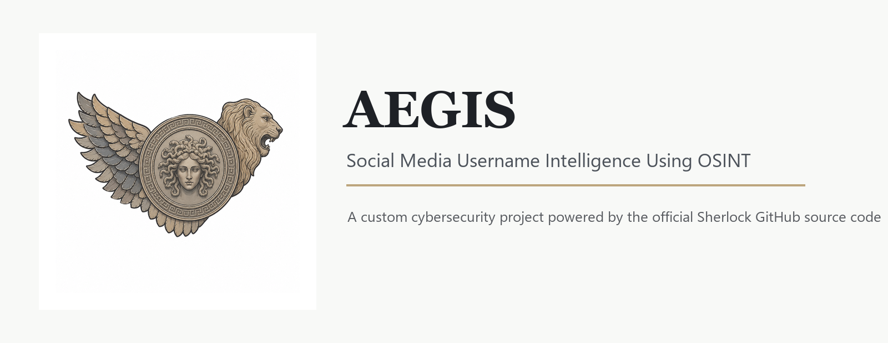

<p align="center">
  
</p>

# AEGIS

AEGIS is a cybersecurity OSINT mini-project for discovering public social media profiles linked to a username.

The project provides a custom command-line workflow and organized result storage. It uses the official open-source Sherlock GitHub source code as the username search engine.

## Project Title

AEGIS: Social Media Username Intelligence Using OSINT

## Features

- Search one username across public websites
- Search multiple usernames in one session
- Save investigation outputs inside the `results` folder
- Verify discovered links and flag false positives
- Keep a clean project structure for report and presentation work
- Uses Sherlock as the underlying OSINT lookup tool

## Result Verification

Some OSINT username tools can return false positives. This happens when a website response looks like a valid profile to the scanner, but the page later opens as `404`, `not found`, blocked, or rate limited in a browser.

AEGIS includes a verification step after each scan. It re-checks discovered URLs and creates:

```text
verified_links.txt
verified_links.csv
```

Possible verdicts include:

- `reachable`
- `not found`
- `blocked or rate limited`
- `unreachable`
- `needs manual check`

## Requirements

- Windows 10/11, Linux, or macOS
- Python 3.9 or newer
- Internet connection
- Git, if cloning the source again
- Sherlock source code in `third_party/sherlock`

Sherlock dependencies used by this project:

- certifi
- colorama
- PySocks
- requests
- requests-futures
- stem
- pandas
- openpyxl
- tomli

## Windows Setup

Check Python:

```powershell
python --version
```

Create a local virtual environment:

```powershell
python -m venv .venv
```

Activate it:

```powershell
.\.venv\Scripts\Activate.ps1
```

Install Sherlock from the cloned GitHub source:

```powershell
python -m pip install -e .\third_party\sherlock
```

## Run AEGIS

Run the browser app:

```powershell
.\run_web_app.ps1
```

Or double-click:

```text
run_web_app.bat
```

Run the terminal app:

```powershell
.\run_aegis.ps1
```

Or double-click:

```text
run_aegis.bat
```

Or manually:

```powershell
.\.venv\Scripts\python.exe .\main.py
```

## Project Structure

```text
AEGIS/
  main.py
  run_aegis.ps1
  requirements.txt
  project_summary.md
  results/
  third_party/
    sherlock/
      pyproject.toml
      sherlock_project/
      docs/
      tests/
```

## Ethical Use

AEGIS is intended for learning, self-auditing, lab work, and authorized cybersecurity investigation only. It searches public information and should not be used for harassment, stalking, impersonation, or collecting personal data without permission.

## Attribution

AEGIS is a student cybersecurity project with a custom workflow, name, and result organization. It integrates the open-source Sherlock OSINT tool as its search engine.

Sherlock GitHub: https://github.com/sherlock-project/sherlock
